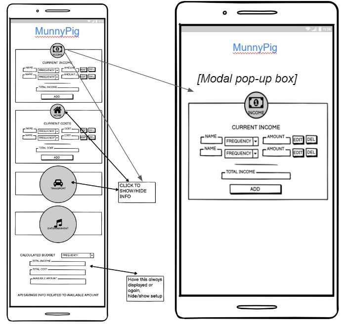

# hackathon-jan-2023
use python3 -m http.server to preview in server

# MunnyPig SavingsApp
​
## Team Name: <<team_name>>
​
[Link to Deployed Project]
https://seanyoung247.github.io/hackathon-jan-2023/
​
## Contents(#contents)
​
* [User Experience (UX)](#user-experience)
  * [User Stories](#user-stories)
* [Technology](#technology)
* [Design](#design)
  * [Color Scheme](#color-scheme)
  * [Typography](#typography)
  * [Imagery](#imagery)
  * [Wireframes](#wireframes)
* [Deployment & Usage](#deployment)
* [Testing](#testing)
* [Credits](#credits)
  * [Code](#code)
  * [Content](#content)
  * [Media](#media)
  * [Acknowledgements](#acknowledgements)
​
## User Experience
Our app is designed for young adults entering the working world.  With a colorful fun interface and catchy name, we intended to get youndg workers thinking about budgeting and saving their money.
​
### User stories
Our users in their late teens and early twenties will tend to have less financial commitments, so our app is clean, simple and uncluttered.  

The logo and hero image explain what the app is designed to do

Scrolling down the page, the user will be able to click one of the Income or Expense items, and enter in their own amounts and descriptions.

With one income area and several expense areas, the user can easily add different income and expenses to the catgeories.

Each category adds the amounts to give a total.

The total of income and expenses and what is remaining are displayed furtehr down the main page, which updates as each new entry is added.

Below that is an API section which introduces our users to certain financial information which they may be interested in.

​
## Technology:
​
<< Detail your techstack here, and why you chose it. >>
​
<< list your languages & tools below: >>
​
*  << languages >>
	* << list the langauge & reason for using it >>
​
* << tools >>
  * << list the tool & reason for using it >>
​
## Initial MVP idea:
​
Initially we had seen a simple budget app on line.  It had 11 pages of inputs but the concept was simple - add various types of income and different expenses to various categories and it would calculate a running total.  This can be seen at https://mabs.ie/money-tools/my-budget/

As a team, we realised that there were too many inputs to code in a short space of time, so we decided to simplify the inputs, which helped us decide on our target audience - young adults with less financial commitments.  This ensured we narrowed our scope.

We also considered our skill level and were sure we could deliver a minimum viable product - a nice one page responsive landing page with a modal that would contain the input and functionality.  With one modal complete we could easily replicate.

​
### Actual idea & content:
​
<< how does you final product/project match up to your initial mvp plans >>
​
<< detail idea / features / functionality here >>
​
## Design
​
### Color Scheme:
<< detail your color palette here >>
​
### Typography:
<< what font pairings did your team consider and pick? And why? >>
​
### Imagery:
<< Detail imagery used to compliment your build & theme >>
​
<< ensure source attribution is maintained, and that you have used copyright free material >>
​
### Wireframes:

Planned functionality

 * Clickable Income / Expenses section
 * Modal pop-out box
 * Text field to enter name of income / expense
 * Frequency drop down
 * Number field to enter amount
 * Edit button to edit the fields
 * Delete button to delete the fields
 * Add button to add another income / expense line
 * Total amount (sums up all the income / expense lines)
​

- Mobile Wireframes:

​

​

- Desktop Wireframes:

​

​

## Deployment
The following steps were taken to deploy this site:

1. The project was originally setup in an online repo on GitHub, with some test pages and an example modal created
2.  The project was immediately deployed to git pages, to ensure there would be no deployment issues
3. Under settings/pages, main branch was selected as the source
4. Each developer worked on a separate branch from the main
5. The project was edited in VS code in a local dev area  
6. Regular commits were added with descriptive commit messages
7. Commits were pushed to GitHUb regularly.  Branches were merged with the main branch regulary, ensuring all merge conflicts were easily resolved.  
8. Link to live site: https://seanyoung247.github.io/hackathon-jan-2023/
​
## Testing
<< detail testing logs here - any known bugs, and squashed bugs 🐛🐛 >>
​
## Credits
​
### Code
<< any and all code that isn't yours...must go here >>
​
### Content
<< any content, such as facts/references/text that isn't yours...must go here >>
​
### Media
<< you may have already done this above in the Imagery section, but just in case, please attribute Media acquisition here >>
​
### Acknowledgements
<< personal thanks and praise 🙌 >>