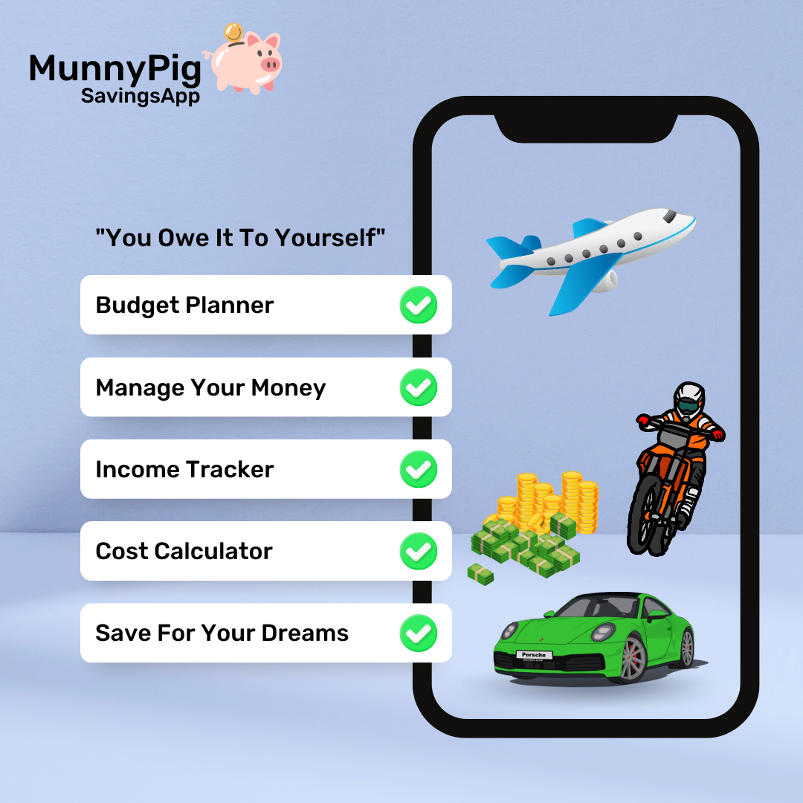
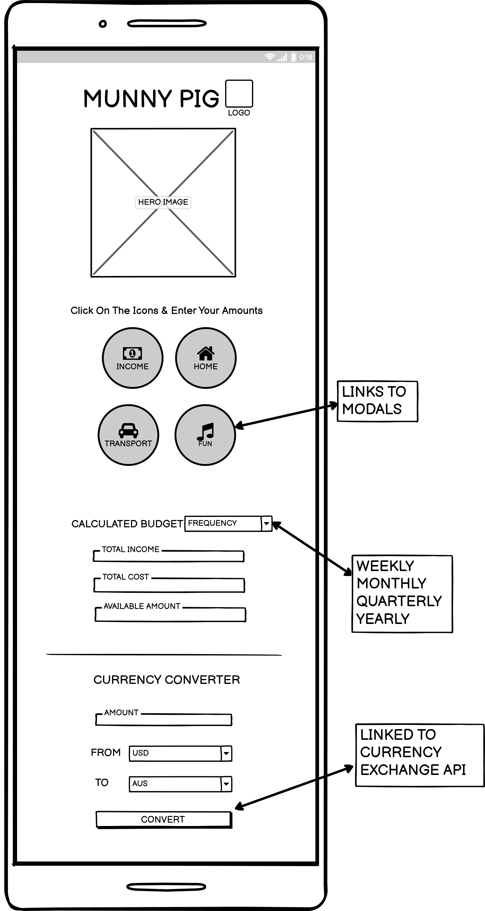
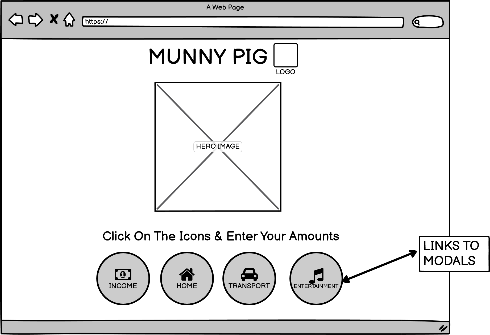
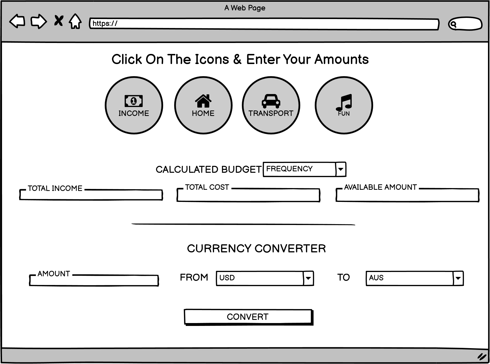
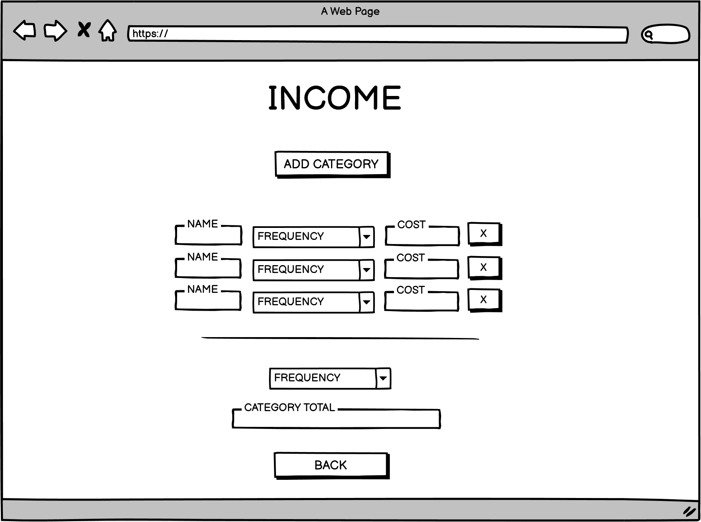

# Hackathon-Jan-2023

# MunnyPig SavingsApp
​
## Team Name: Once Upon A Dime
​
[Link to Deployed Project](https://seanyoung247.github.io/hackathon-jan-2023/)

Gitpod reminder: Use "python3 -m http.server" to preview in server()
​
## Contents(#contents)
​
* [User Experience (UX)](#user-experience)
  * [User Stories](#user-stories)
* [Technology](#technology)
* [Design](#design)
  * [Color Scheme](#color-scheme)
  * [Typography](#typography)
  * [Imagery](#imagery)
  * [Wireframes](#wireframes)
* [Deployment & Usage](#deployment)
* [Testing](#testing)
* [Credits](#credits)
  * [Code](#code)
  * [Content](#content)
  * [Media](#media)
  * [Acknowledgements](#acknowledgements)
​
## User Experience
Our app is designed for young adults entering the working world.  With a colorful fun interface and catchy name, we intended to get youndg workers thinking about budgeting and saving their money.
​
### User stories
Our users in their late teens and early twenties will tend to have less financial commitments, so our app is clean, simple and uncluttered.  

The logo and hero image explain what the app is designed to do

Scrolling down the page, the user will be able to click one of the Income or Expense items, and enter in their own amounts and descriptions.

With one income area and several expense areas, the user can easily add different income and expenses to the catgeories.

Each category adds the amounts to give a total.

The total of income and expenses and what is remaining are displayed furtehr down the main page, which updates as each new entry is added.

Below that is an API section which introduces our users to certain financial information which they may be interested in.

​
## Technology:
​
The site is based around a dynamic frontend using HTML/CSS and JavaScript. In order to simplify custom component creation and use, [WebComponents](https://developer.mozilla.org/en-US/docs/Web/Web_Components) are used for several user interface components. This allows the encapsulation of layout, styling, and state. It also allows easy reuse of components and code. WebComponent source code can be found in the [components directory](https://github.com/seanyoung247/hackathon-jan-2023/tree/main/assets/js/components).

In order to promote code modularity and aid in collaboration, ES6 modules are used. Individual features are seperated out to their own module and code is imported when and where it is needed.
​
* Languages
	* HTML
  * CSS
  * JavaScript

​
## Initial MVP idea:
​
Initially we had seen a simple budget app on line.  It had 11 pages of inputs but the concept was simple - add various types of income and different expenses to various categories and it would calculate a running total.  This can be seen at https://mabs.ie/money-tools/my-budget/

As a team, we realised that there were too many inputs to code in a short space of time, so we decided to simplify the inputs, which helped us decide on our target audience - young adults with less financial commitments.  This ensured we narrowed our scope.

We also considered our skill level and were sure we could deliver a minimum viable product - a nice one page responsive landing page with modals that would contain the input and functionality.  With one modal complete we could easily replicate.

​
### Actual idea & content:
​
<< how does you final product/project match up to your initial mvp plans >>
​
### Features included
The MVP was very close to the planned idea
* We created an attractive landing page
* We focussed on 4 input icons - Income, Home, Transport and Fun
* The Modals allowed correct input of data and totaled up the category

### Future ideas
* A user login area where the data can be saved and updated
* 'Future additions' could be parsing off portion of savings for something specific ie. new car, or a holiday 
* remainder going into long term savings with interest rates applied.
* links to various financial options such as investing in commodoties, Stocks & Shares ISA, Mortgage ISA etc

​
## Design
​
### Color Scheme:
A pale blue background was chosen to contrast with black text and pink elements taken from the Pig icon for consistency
Inside the modals we introduced a navy blue font, and buttons to contrast against the pink background
​
### Typography:
Roboto font was chosen for Google Fonts for a clear, modern and easy to read font
​
### Imagery:
Draft hero image and MoneyPig logo created on [Canva](https://www.canva.com/)

​

### Wireframes:

Planned functionality

 * Clickable Income / Expenses section
 * Modal pop-out box
 * Text field to enter name of income / expense
 * Frequency drop down
 * Number field to enter amount
 * Edit button to edit the fields
 * Delete button to delete the fields
 * Add button to add another income / expense line
 * Total amount (sums up all the income / expense lines)
 * API with intereest rates and inflation rate to link to disposable income - to show affect of savings over time
​

Mobile Wireframes:

​

Desktop Wireframes:
​​

## Deployment
The following steps were taken to deploy this site:

1. The project was originally setup in an online repo on GitHub, with some test pages and an example modal created
2.  The project was immediately deployed to git pages, to ensure there would be no deployment issues
3. Under settings/pages, main branch was selected as the source
4. Each developer worked on a separate branch from the main
5. The project was edited in VS code in a local dev area  
6. Regular commits were added with descriptive commit messages
7. Commits were pushed to GitHUb regularly.  Branches were merged with the main branch regulary, ensuring all merge conflicts were easily resolved.  
8. Link to live site: https://seanyoung247.github.io/hackathon-jan-2023/
​
## Testing
The following tests were performed on the app
* W3C HTML validation
* W3C CSS Validation
* Lighthouse Test
* Manual testing of the Modal Category Calculation

### Bugs known

### Bugs squashed
* There was a bug that prevented a calculation of the correct amount between week, month and year.  This was resolved by changing the formula

### Improvements needed
* Modal: Make it easier to see additional income and expense lines (make the section a bit bigger)
* Modal: Change “Add category” button text to simply “Add”
* Modal: Have another “Add” button next to X button
* Modal: Change the "Back" button to "Close" and put a X button in the top right corner of the modal box
* Modal: Change “Cost” label in income modal to "Amount"

​
## Credits
​
### Code
Code used for API from [API NINJA](https://api-ninjas.com/)
​
### Content
All content used is unique to this project
​
### Media
Images and logo and background was created on [Canva](https://www.canva.com/) - royalty free use.
​
### Acknowledgements
What an incredible team, credits go to: and in no particular order:
* Monica came up with the basic idea of a budgeting app and having an example to look at. She also worked on the API section and styled the Modals
* Rhys created the intial wireframes which gave the team something visual to aim for, and then played a big part in styling the landing page.
* Russ took on the role of Scrum Master, GitHub and Gitpod manager and worked on intial HTML and added to landing page CSS
* Marcus worked on a canva design to bring some color and the design to life
* A massive shout out to Sean who lead the Javascript Section and created the modal functionality, which is the core piece of the app.
